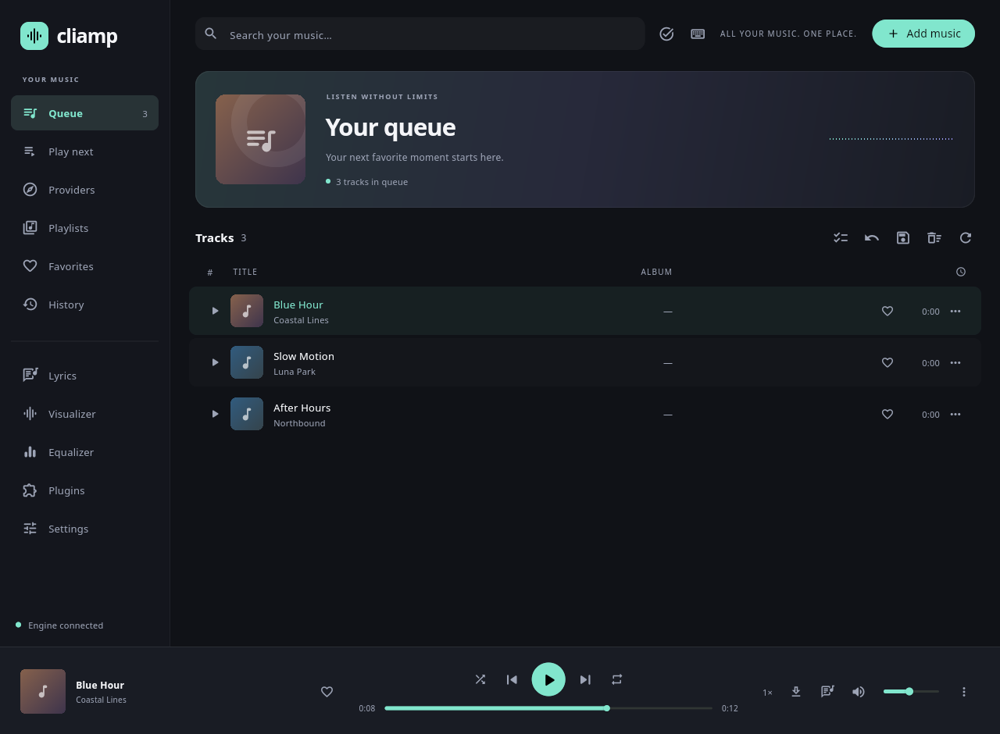

# Flutter desktop app

Cliamp Desktop is a modern Flutter frontend for the existing Go player, with
native projects for Linux, Windows, and macOS. The Go engine keeps audio decoding,
providers, playlists, history, EQ, plugins, and remote control in one place.
The terminal player remains available. See [feature parity](desktop-feature-parity.md)
for implemented workflows and remaining platform/account acceptance checks.



*Linux release using generated local audio.*

The desktop window has a 640×480 minimum content size. Provider browsers scroll in short windows so collection controls and tracks stay reachable. Short windows use a
compact library heading; longer visualizer controls and import dialogs scroll.
Library and provider counts use singular labels for one item.

## Prerequisites

Use Flutter 3.47.7 and Go 1.26.6 from `mise.toml`. Flutter desktop builds must run
on their target operating system; a Linux build does not validate Windows or
macOS. Run `flutter doctor` and resolve the desktop toolchain for your platform.

| Platform | Build and runtime prerequisites |
| --- | --- |
| Linux | Clang, CMake, Ninja, pkg-config, GTK 3 development files, ALSA, FLAC, Vorbis, Ogg, and mpg123 development files |
| macOS | Xcode and command-line tools, CocoaPods when required by Flutter, Homebrew `flac libvorbis libogg mpg123 pkg-config` |
| Windows | Visual Studio with Desktop development with C++; MSYS2 MinGW64 GCC, pkg-config, FLAC, Vorbis, Ogg, and mpg123; put the MinGW64 `bin` directory on PATH when building and running |

The [source build instructions](../README.md#building-from-source) list the
codec packages. FFmpeg and yt-dlp remain optional, with the same format and
provider requirements as the terminal app. They must be on the desktop process's
PATH when those features are used.

## Develop

Build the engine from the repository root:

```sh
go build -o cliamp .
cd desktop
flutter pub get --enforce-lockfile
```

Set `CLIAMP_BINARY` to the absolute path of the built engine, then run the target:

```sh
# Linux/macOS example, from desktop/
CLIAMP_BINARY="$(pwd)/../cliamp" flutter run -d linux
# On macOS, replace linux with macos.
```

On Windows, set `$env:CLIAMP_BINARY` in PowerShell to the absolute path of
`cliamp.exe`, then run `flutter run -d windows`.

The app attaches to a running cliamp instance using the same configuration
folder. If none is running, it starts its own headless engine. Closing the app
stops only an engine it started. Existing players keep running. Both frontends
share the player's config and library; do not run two independent players
against the same directory when editing settings.

`CLIAMP_CONFIG_DIR` can isolate a test instance. Use **Connect service** in
Providers or Settings to configure a provider with the existing wizard rules.
The form masks credentials and passes them privately to the engine over stdin.
After saving, choose **Restart player** to reload an app-owned engine. Playback
briefly stops while the engine reloads; the app restores the queue, play-next
order and active playback position. For an attached engine, restart it where it
was started. Browser sign-in is available on providers that support it. Provider
setup and credentials remain in the existing cliamp configuration. Never put credentials in build
scripts or Flutter assets.

## Build a development bundle

From the repository root:

```sh
python3 desktop/tool/build.py
```

This runs the native Flutter release build and places the Go executable beside
the desktop executable. Add `--debug` for a debug bundle. `make desktop` invokes
the same script. Bundles keep the complete Material icon font so incremental
builds cannot reuse an outdated icon subset. Keep the whole bundle together:

- Linux: `desktop/build/linux/<architecture>/release/bundle/`
- macOS: `desktop/build/macos/Build/Products/Release/Cliamp.app`
- Windows: `desktop/build/windows/<architecture>/runner/Release/`

These are development bundles; macOS bundles are re-signed ad hoc after the
sidecar is staged. The Go sidecar links to the codec libraries
listed above, which must be installed on the target machine. Installers,
redistribution of codec libraries, platform signing, and macOS notarization
are separate release work. The macOS app uses a non-sandboxed development
entitlement so the engine can use its existing configuration and music files.

## Validate

```sh
cd desktop
flutter analyze
flutter test
CLIAMP_BINARY=/absolute/path/to/cliamp dart run tool/backend_smoke.dart
```

The smoke check creates isolated temporary configuration and generated WAV
audio, uses an ALSA null sink on Linux, and exercises real playback, atomic source
and queue edits, saved playlist ordering/undo, directory sources, lyrics timing,
direct visualizer frames, preferences, reviewed plugin trust, provider setup,
ownership, restart and shutdown. It is not an audible playback test.
The Go tests remain necessary when changing the shared engine.

The cloud development machine has local toolchains and native libraries:

```sh
source /workspace/.cliamp-env/activate.sh
source /workspace/.flutter-env/activate.sh
cd /workspace/cliamp-desktop/desktop
```

The Flutter activation must follow the Go activation; it selects the merged
native library metadata used by the desktop runner and Go sidecar. The cloud
machine uses a null audio sink for smoke checks and needs a virtual display
for window validation; regular desktop machines use their actual sound and display.

## Provider setup protocol

The interactive `cliamp setup` command is unchanged. Desktop clients use:

```sh
cliamp setup schema [--provider KEY]
cliamp setup apply --provider KEY [--save-without-check]
```

Both read a JSON object of string values from stdin, limited to 64 KiB, and
return JSON. Close stdin after writing. An unsuccessful request exits nonzero.
Schema responses describe provider choices, conditional fields, and defaults;
they never return stored or submitted credentials. Apply uses the existing
validation and section writer, preserving unrelated keys/comments. A successful
save returns `restart_required: true`. The explicit `--save-without-check`
option skips the live server probe only; required fields, URLs, environment
references, and provider limits still apply. Never put credentials on the
command line or in the Flutter asset bundle.

## Library and playback workflows

The command palette accepts Return to run its first matching result. Escape clears provider search and releases editing focus. Background queue updates preserve loaded pages and selection when the ordered tracks are unchanged.

The desktop validates local playlist entries before importing them. A missing file or a directory used as an audio entry leaves the current queue intact. Background activity lists active and completed operations in a resizable dialog.

Synced lyrics keep the active line visible when the window is resized while Follow lyrics is enabled. Visualizer captions follow the selected light or dark theme. Podcast catalogs use show-specific labels. Long error messages scroll within a bounded notification above the player. Keyboard shortcuts remain available after native file and folder imports.

**Add music** accepts native file/folder selection or entered file, playlist,
URL and SSH paths. Choose append or replace and whether to start playback. The
engine resolves a selection before replacing the queue, so a failed source leaves
the previous list intact.

The queue and library use fuzzy filtering. **Select tracks** enables individual
or Shift-range selection; **Select visible** selects the current filtered page.
Selected tracks can be appended, queued next, used to replace the queue, saved
or removed in one edit. Live edits carry the revision belonging to the displayed
rows, and a conflict reloads instead of applying a stale row index.

Saved-playlist tools expose supported actions: native **Add files** directly to
the saved list, prepend/append, complete-list sort and reorder, directory sources,
recursive scanning and undo. Adding files resolves the whole selection first
and leaves the live queue unchanged. Directory
tracks remain backed by their source rather than becoming duplicate explicit
rows. Saving the current queue captures the complete engine queue even when the
UI has only loaded a page. After creating, renaming or deleting a playlist,
**Undo last playlist edit** restores that edit from the playlist list when the
provider supports undo. A failed undo remains available to retry.

Provider pages use the service's browse labels and capabilities. This includes
refresh, genres/categories and pinned favorites, related songs, artist links,
subscriptions and newest-episode actions where supported. Radio location remains
unused until an explicit allow/deny choice. Episode markers display the engine's
locally known listening state. **Add to queue** appends an individual track;
**Add collection to queue** resolves the complete collection with its current
filter, including tracks beyond the displayed page, while keeping playback and
the play-next list intact.

**Lyrics** can follow playback, pause following while scrolling, seek by line
and adjust the shared timing offset. Live streams and untimed text are displayed
without an invented playback timebase. **Visualizer** renders the engine's
original built-in and Lua modes, with theme/mode preview, apply/cancel and
fullscreen. Appearance is shared with an attached terminal.

Fullscreen keeps playback controls available: play/pause, previous/next,
five-second seeking, and volume changes of 1 dB. Seeking is disabled for
non-seekable sources. Press **Space** to toggle playback, **,** or **.** to
change track, **Left/Right** to seek, **-/+** to adjust volume, **T** to show or
hide track information, **V** to cycle visualizers and **Esc** to leave
fullscreen. Ctrl/Cmd+Left/Right also changes track.

The command palette lists desktop controls and registered plugin key actions.
Common shortcuts are:

| Shortcut | Action |
| --- | --- |
| Space | Play/pause |
| Ctrl+Left / Ctrl+Right | Previous/next |
| Alt+Left / Alt+Right | Seek backward/forward |
| Ctrl+Up / Ctrl+Down | Volume up/down |
| Ctrl+O | Add music |
| Ctrl+F | Search |
| Ctrl+J | Jump to an exact playback time |
| Ctrl+Z | Undo queue or saved-playlist edit |
| Ctrl+S | Download playing track |
| Ctrl+K or F1 | Command palette |
| Ctrl+X | Compact player |
| Escape | Close the current popup, or clear selection/search and leave the search field |

Click the current playback time or use **Jump to time** to enter seconds,
`MM:SS`, or `HH:MM:SS`. On macOS, Cmd+J also opens this dialog. The app checks
the track again before seeking so a track change cannot apply the old target
to the next song.

Playback/edit shortcuts do not fire while typing in a text field. Long
operations appear in the activity view, with cancellation when supported.
An operation timeout is not permission to replay a mutation automatically.

## Preferences and plugins

Settings includes searchable grouped preferences for playback, audio quality,
startup, downloads, appearance and provider options. Saving preserves unrelated
config sections. Settings with startup effects require selecting **Restart player**.
The app retains the listening queue and does not restart an attached player.
Provider passwords and stored tokens are handled separately by account setup.

The plugin manager can list, install, trust, remove, enable/disable and configure
plugins. Installation and trust are two steps: first review the exact source,
SHA-256 and declared permissions, then approve those exact bytes. Preparing or
canceling a review does not install or trust anything. Plugin configuration values
are submitted privately and never returned by the installed-plugin list.
Runtime commands and registered key actions remain available through the player.

The management commands are also available to other desktop clients:

```sh
cliamp preferences schema
cliamp preferences apply
cliamp plugins desktop list
cliamp plugins desktop prepare
cliamp plugins desktop review
cliamp plugins desktop apply
cliamp plugins desktop trust
cliamp plugins desktop remove
cliamp plugins desktop configure
```

`preferences apply` reads a JSON object of string values on stdin. Its schema
returns only explicitly listed nonsecret fields with types, limits and choices;
invalid or unknown fields reject the change before writing.

Plugin commands read one JSON object on stdin, bounded at 64 KiB. `prepare`
takes `source`; `review` takes the installed `name`. They return a `review` with
`token`, `source`, `sha256`, `permissions`, `code` and implicit-access information.
`apply` or `trust` must echo the reviewed token, source, digest and permissions.
The approval is single-use and changed installed content cannot inherit an old
approval. `configure` takes `name` and a string `values` map; `remove` takes
`name`. Successful changes report `restart_required`. These management commands
operate outside IPC so they also work before the audio engine starts.

## Native UI audit

On Linux, install Xvfb, xfwm4, ImageMagick (`import`), ffmpeg, dbus-run-session and libXtst in addition to
the desktop build prerequisites. From the repository root, run:

```sh
python3 desktop/tool/native_audit.py --engine /absolute/path/to/cliamp
```

The audit opens the actual Flutter Linux window and connects it to the real Go
engine using generated audio and isolated profiles. It records interaction
results, framework errors and native screenshots in a temporary directory.
`--output /path/to/evidence` retains results at a chosen location; `--display :106`
selects a different unused X11 display. The null audio output supports playback
state checks but does not verify audible sound. Account-backed services and the
Windows/macOS runners require separate native acceptance testing.

See the [audit report](qa/desktop-audit.md), [UI inventory](qa/desktop-ui-inventory.md),
and [defect log](qa/desktop-defects.md) for execution evidence and validation limits.
