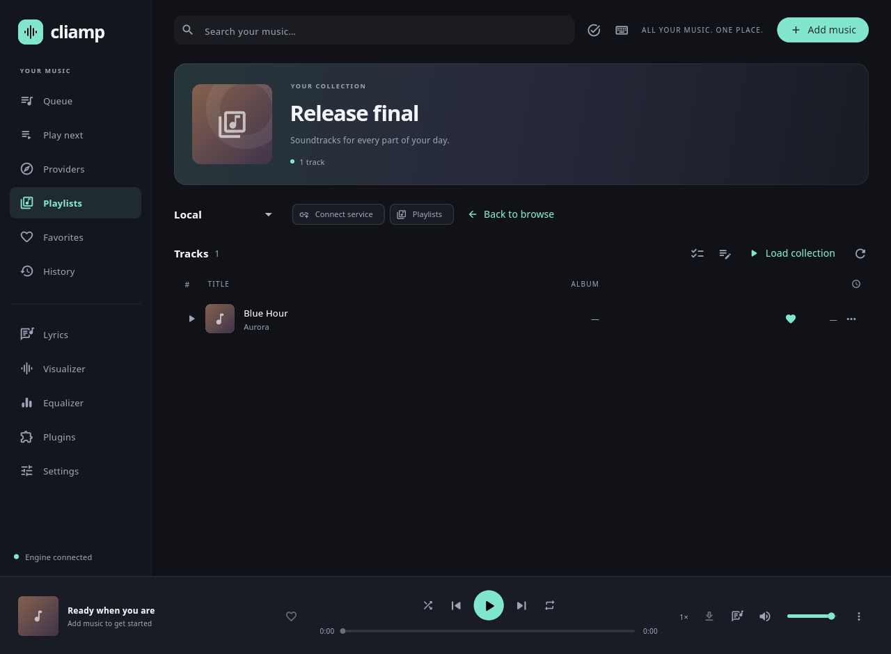
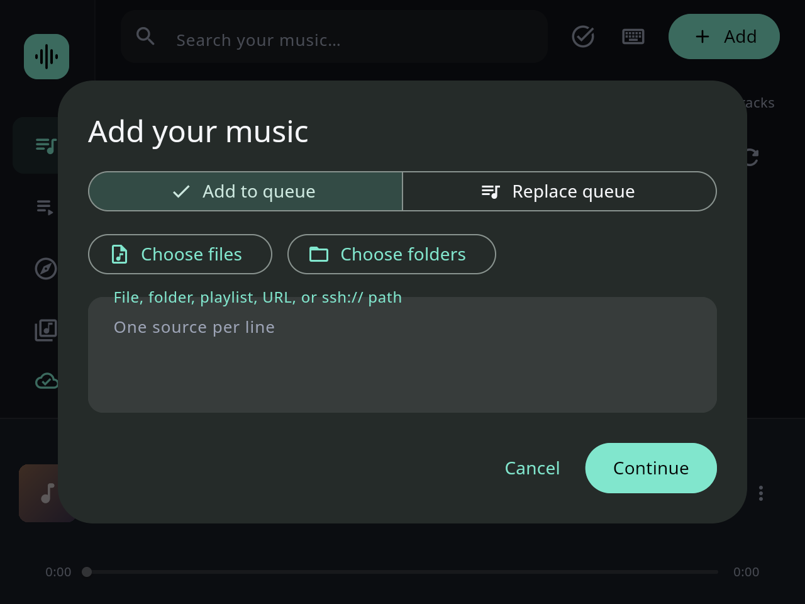

# Desktop hands-on audit

**PASS: the complete Linux local/public-provider walkthrough, separate-process persistence, and final release smoke test.** All 31 reproduced application defects are fixed. ENV-001 remains an unresolved headless-renderer observation; platform/account limits are listed below.

## Application tested

Cliamp Desktop **0.1.0+1**, Flutter frontend with the real Go audio engine. Baseline `261ead0` was merged as `1aa11a0`. The follow-up is on `codex/desktop-qa-fixes`. The tested application is commit `f0bf2459455f886eb7c3f8dbc22fecea3e8ba763`, including BUG-031, the queue-loading race correction. The final documentation commit adds evidence without changing the tested application. Release hashes, the separately compiled native-audit engine hash, and individual stage outcomes are in [verification.json](verification.json). The native walkthrough uses the local Go build; the independent release smoke test uses the staged `-trimpath` sidecar.

## Test environment

- Debian GNU/Linux 13.6 (trixie), Linux 6.18.44, x86_64.
- Go 1.26.6; Flutter 3.47.7 (`abaf9c5237`); Dart 3.13.5; engine `deb287481e`.
- GTK desktop runner, Xvfb 2560×1600, xfwm4, D-Bus, software rendering.
- ALSA null output. Playback state is observable; physical audible quality is not.
- Disposable engine profiles, generated WAV/FLAC files, M3U/PLS fixtures, a 205-track library, local RSS/audio and plugin HTTP servers. No private provider credentials are configured.

## Method and evidence

The audit launches a real native Flutter window and its real Go sidecar. Native integration actions use the rendered UI; no engine mock is substituted. Text entry and Ctrl shortcuts use the OS keyboard/clipboard, while GTK pickers use native mouse/keyboard input. X11 screenshots verify actual window dimensions. Framework exceptions and render overflows fail the run. Separate widget and Go tests protect lower-level regressions.

The [complete UI inventory](desktop-ui-inventory.md) lists controls, all 69 preference fields, and all 14 service forms. The [live defect log](desktop-defects.md) records each reproduction, expected/actual result, root cause, changed files, fix and retest. Test-helper errors are not counted as application defects.

`desktop/tool/native_audit.py` runs the entire walkthrough, a separate-process persistence check, and an independent location-consent pass. It saves action/result JSON, native screenshots and logs. Its full run does not inherit incremental phase or skip flags.

## Areas exercised

| Area | Native checks |
|---|---|
| Navigation/layout | All 11 pages; compact rail/player; small, normal, wide/short and tall/narrow windows; below-minimum attempts; maximize/restore; dialog resizing |
| Imports and errors | Files/folders, multiple selection, OS picker select/cancel, Unicode and multiline paths, M3U/PLS, failed replacement preserving the queue, missing/corrupt/unsupported/read-only files, long errors, clear/undo |
| Queue and saved library | Playback rows and menus, favorites, details, range/batch selection, append/replace/remove/save/prepend, play-next ordering and clear, create/rename/delete/cancel/undo, six saved-playlist sorts, directory sources/recursion, queue and saved-playlist pagination |
| Player/keyboard | Play/pause/stop, previous/next, seek drag/exact time, volume drag/dialog/apply/cancel, all seven speeds, repeat/shuffle/mono, lyrics and download controls, command palette, text editing, focus return, real Linux MPRIS calls |
| Settings/setup | Every preference field and section collapse/expand; validation and save/reopen; every service and conditional connection form; required/Unicode inputs and secret masks; connection failure, explicit offline save and Later |
| Visualizer/EQ/lyrics | All 34 visualizer modes and 23 themes with engine-state confirmation; preview/apply/cancel; fullscreen controls/keys; four light-theme contrast measurements; all EQ presets/bands; synced, untimed and live-labeled lyrics; seek, offset limits, follow and resize |
| Providers/podcasts | Public provider routes, country/tag pinning and filtering, sorting/pagination, collection append/play, search/clear/reload, location consent, local RSS subscribe/unsubscribe and every episode action |
| Plugins/jobs/recovery | Source review and validation, exact-content approval, install/configure/toggle/remove, command and keyboard action, engine restart retaining queue/position/play-next, running-job cancellation, owned-engine failure/reconnect |
| Developer operations | All 123 operation-selector entries, invalid/valid JSON, running a queue query and inspecting feedback. Selecting an operation is not a claim that every parameterized engine operation was executed. |

Account-specific controls requiring authenticated providers remain outside verified native coverage; see the limits below. The inventory distinguishes these from passed local/public workflows.

## Bugs fixed

**31 reproduced application defects logged, plus ENV-001 (unresolved renderer observation).** Full details and individual file references are in the [defect log](desktop-defects.md).

| Defects | Correction | Main files |
|---|---|---|
| 001–003, 005–006 | Usable minimum layout, scrolling dialogs/visualizer, visible selection scrollbar, notifications above playback | `app.dart`, `visualizer.dart`, Linux/macOS/Windows runners |
| 004, 010, 012–013 | Required-input and schema validation; dialog-owned editing resources survive route dismissal | `app.dart`, `preferences.dart`, `plugin_manager.dart` |
| 007–008, 011, 026, 029 | Honest unknown durations, stable slider accessibility, restart retention, queue selection/page retention and native-picker focus restoration | `app.dart`, `backend.dart` |
| 009 | Ignore unchanged or invisible spectrum/state updates that caused excessive idle redraws | `app.dart` |
| 014, 023–024 | Search releases focus, Return executes palette matches, provider Escape clears search and returns from remote results | `app.dart`, `provider_browser.dart` |
| 015–022, 027–028 | Activity-dialog constraints, atomic local import validation, readable/scrollable errors, lyric resize following, theme contrast, podcast terminology/counts, short provider layouts | `app.dart`, `jobs.dart`, `lyrics.dart`, `visualizer.dart`, `provider_browser.dart`, `ui/model/ipc_sources_desktop.go` |
| 031 | Reconcile queue revisions received during navigation or pagination | `app.dart` |
| 030 | Singular counts for one library item | `app.dart` |
| 025 | Podcast catalog/search favorite flags agree with subscription state | `external/podcast/provider.go` |

Visual evidence includes [small queue before](screenshots/queue-before-640x480.png)/[after](screenshots/queue-after-640x480.png), [visualizer before](screenshots/visualizer-before-640x480.png)/[after](screenshots/visualizer-after-640x480.png), [provider overflow before](screenshots/provider-collection-before.png)/[after](screenshots/provider-collection-after.png), [lyrics before](screenshots/lyrics-before-resize.png)/[after](screenshots/lyrics-after-resize.png), [light caption before](screenshots/light-theme-caption-before.png)/[after](screenshots/light-theme-caption-after.png), [bounded error](screenshots/long-error-after.png), and [activity dialog](screenshots/activity-after-640x480.png), and [stale-revision failure](screenshots/queue-revision-before.png)/[successful batch retest](screenshots/queue-revision-after.png).

## Automated regression protection

- App tests: responsive layout, input feedback, notification bounds, populated activity, durations, slider semantics, idle frame scheduling, slow dialog dismissal, command submission, native-picker focus loss, paginated queue selection, and runtime revisions received during navigation. The last regression failed with revision 41 before the fix and passes with revision 84 afterward.
- Backend tests: capture/restore beyond 200 tracks, playback state and play-next retention, and capture failure leaving the old engine running.
- Preferences/plugin tests: number/list/EQ validation and explicit review of plugin contents.
- Provider/lyrics tests: Escape after search submission, restored results/focus and active lyric visibility after resize.
- Go tests: reject missing/non-file local playlist entries before queue replacement; subscription favorite state across catalog/search sections.
- Native regression runner: real desktop/engine workflows and separate-process persistence, including the original failure sequences.

## Final verification

- **PASS:** `make check` (format, vet and tests; 59 packages with passing tests), under a Linux child-subreaper wrapper.
- **PASS:** all **114 Flutter tests** after the latest product fixes.
- **PASS:** `flutter analyze` after the latest application change; no issues found.
- **PASS:** targeted native visualizer, palette, source, library, podcast, lyrics, plugin/restart, download, cancellation, recovery, setup-save and native file-picker workflows. All four available provider browsers also passed their targeted run. The uninterrupted final combined run also passed.
- **PASS:** separate-process preference/library/history persistence, fresh-profile location consent, matched release measurement, and the independent release smoke/scaling run.
- **PASS:** the uninterrupted **43-minute** walkthrough, followed by both fresh-process checks: **266 passing stages**, **1,760 recorded click actions**, **509 native resize actions**, and **3,129 evidence entries**. No framework exception, render overflow, warning, or critical message appeared in these final native logs. Individual outcomes are in [verification.json](verification.json).

The container's PID 1 does not reap orphaned children. An existing Lua child-process test mistakes zombies for live processes in an unwrapped run. The local subreaper supplies normal child reaping; no product behavior or test assertion was weakened.

## Performance

A matched comparison used the baseline frontend and final release with the same Go engine, fresh isolated profiles, 20 seconds of warmup and 10-second samples. No native test was running during measurement.

| Frontend | Idle CPU (% of one core) | RSS |
|---|---:|---:|
| Baseline | 229.74% | 295.0 MiB |
| Final | 1.40% | 283.7 MiB |

Both releases shut down their owned engine processes after native window close. These Xvfb/software-rendering results demonstrate the redundant-redraw correction on this host; they are not a hardware performance guarantee.

## Independent release smoke test

The Linux release at application commit `f0bf2459455f886eb7c3f8dbc22fecea3e8ba763` was launched independently of Flutter's test driver. Native mouse clicks and keyboard input verified:

- Bundle discovery without `CLIAMP_BINARY`: launch the staged sidecar, import a WAV, close and confirm its daemon/event/spectrum processes exit.
- Ctrl+O, entered WAV import, row playback, favorite toggling and singular count labels.
- Save queue with typed name and Return; close the native window; confirm the owned engine/event/spectrum processes exit.
- Relaunch into the same profile, reopen **Release final**, and verify **Blue Hour** and its favorite remain.
- At `GDK_SCALE=2`, resize to 1280×960 physical pixels (640×480 logical), open/dismiss Add music after restoring the initially maximized native window. Controls and dialog actions remain reachable, with no visible clipping in the inspected states.

Window size/position and selected page reset to defaults on launch; with `auto_play=false`, the unsaved live queue starts empty. Saved playlists, favorites and history remain available. These reset behaviors are observations, not claims of window/session persistence.

The ALSA null device consumes samples faster than real time. Playback state and seeking can be checked, but these runs cannot validate audible playback or real-world playback timing.

## Investigated runtime warning

Repeated native resizing under Xvfb/Mesa emits `Timed out waiting for OpenGL frame of size …` in both the baseline release (7 occurrences in an 18-resize probe) and release `2f1aebb` (3 in the equivalent probe). The final `f0bf245` release also reproduced the warning during native display scaling. Flutter's `fl_compositor_opengl.cc` reports this when its 100 ms framebuffer-size wait expires. The next frame recovers; inspected dialogs remain intact and responsive. Adding xfwm4 does not eliminate it. An attempted environment switch did not change the release renderer, so no alternate-renderer pass is claimed.

This observation is **not fixed or suppressed**. It requires investigation in Flutter/the graphics stack and comparison on a physical GPU, unavailable in this cloud host. There were no corresponding Dart exceptions or persistent layout failures. See ENV-001 in the defect log. The complete application audit result below is scoped separately from this renderer warning.

## External verification limits

- **Windows/macOS:** this Linux host cannot launch either native runner. Their native builds, window behavior, platform media keys and packaging require the respective operating systems.
- **Live accounts:** no provider credentials, private media servers or SSH test endpoint are configured. Authentication, private catalogs, account playback and private SSH sources cannot be certified from public/local-fixture checks.
- **Physical hardware:** ALSA null output does not test audible output, real device switching, physical media-key hardware or GPU-specific rendering.
- **Hosted CI:** GitHub Actions cannot start because the repository account is billing-locked. The checked annotation is: “The job was not started because your account is locked due to a billing issue.” [Observed run](https://github.com/goshitsarch-eng/cliamp-desktop/actions/runs/38032404527). Local results do not establish hosted CI success.

## Reusable cloud setup

The onboarding configuration draft's `start_skill` now records activation order, frozen dependency checks, Go subreaping, sequential Flutter validation, release build, and isolated native-runner startup/readiness/cleanup. It also records the exact platform/account/hardware limitations. The draft was saved successfully; publishing and testing restoration in a fresh task are separate user actions and have not been claimed.

## Final result

**PASS for the complete Linux walkthrough supported by this environment.** The application was rebuilt and relaunched after the last code fix; the uninterrupted native run, process-relaunch checks, and independent release smoke test passed. All 31 application defects have passing regression evidence. ENV-001, Windows/macOS execution, authenticated services/private SSH, physical audio/GPU checks, and billing-blocked hosted CI remain explicitly unresolved or unverified. No complete cross-platform or authenticated-provider pass is claimed.
